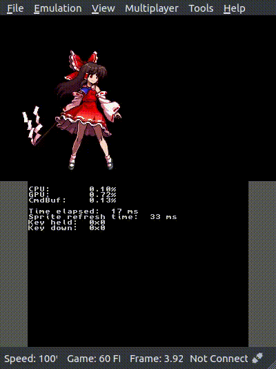

## Simple basic animation using the citro2d library

The 3DS models and system versions we tesetd are:
|Model|System version|
|-|-|
|New Nintendo 3DS LL|Sys 11.14.0-46J|
|New Nintendo 3DS|Sys 11.15.0-47J|

The Citra versions we tested are:
|Build |Release version|
|-|-|
|Citra Canary|1992|

This is a modified project from the gpusprites example. (https://github.com/devkitPro/3ds-examples/tree/master/graphics/gpu/gpusprites)

### Prerequisite

  - devkitPro 3ds-dev
  - citro2d library
  
Follow the guidelines from the [devkitPro website](https://devkitpro.org/wiki/Getting_Started#buildscripts)

### How to use

1. To build the project, type command
   ```bash
   make
   ```
2. Copy the `reimu_idle.3dsx` to the 3DS console.
3. Launch the homebrew launcher and execute the `reimu_idle.3dsx`.

### Result

Reimu sprite animation (idle)
(Animation source: Touhou 13.5: Shinkirou - Hopeless Masquerade)



- Press + key to move the object
- Adjust the sprite animation refresh time (17ms - 1s)
- To activate or deactivate the animation loop once, press X or Y respectively
